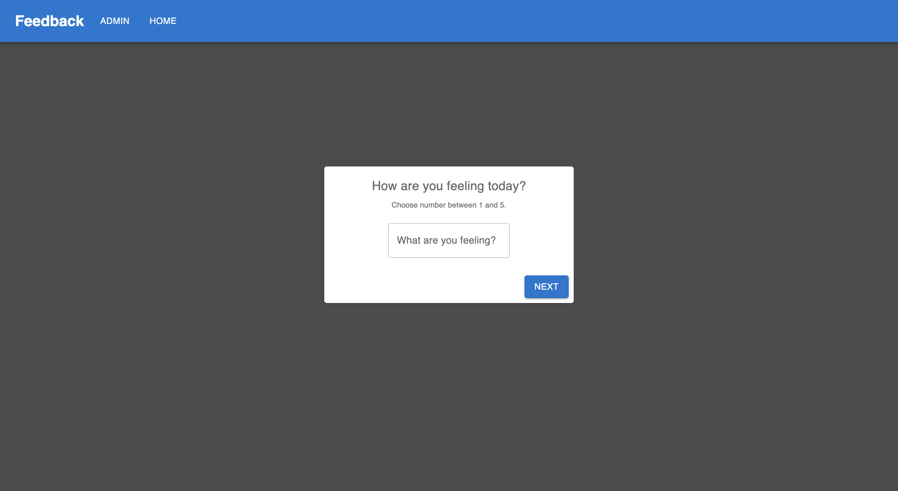
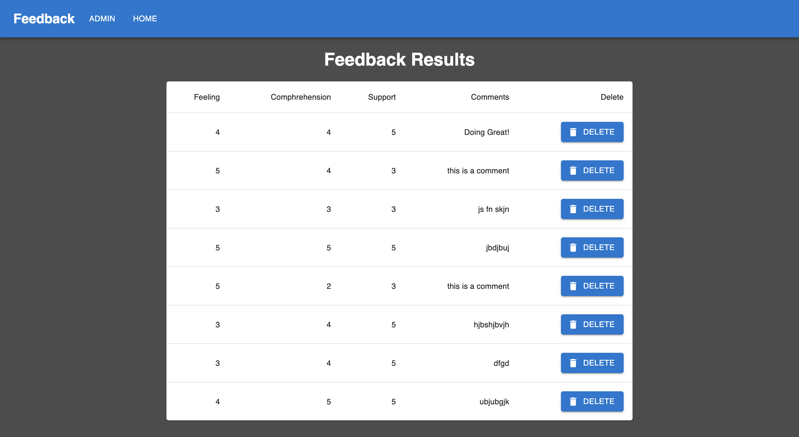

# Feedback Form

## Description
A multipage form that records a users input based on multiple prompts and stores them in a database. The app also has an admin page that displays information for each response as well as the ability to delete any response. 

## Tech
- React
- Redux
- Node.js
- Express
- PostgreSQL
- Material UI

## Installation
1. Fork and clone repository.
2. Run "npm i" to install all dependencies.
3. Run "npm run client" to start client.
4. Run "npm run server" to start server.
5. Copy queries from data.sql file and run them to set up database.

## Screenshots

